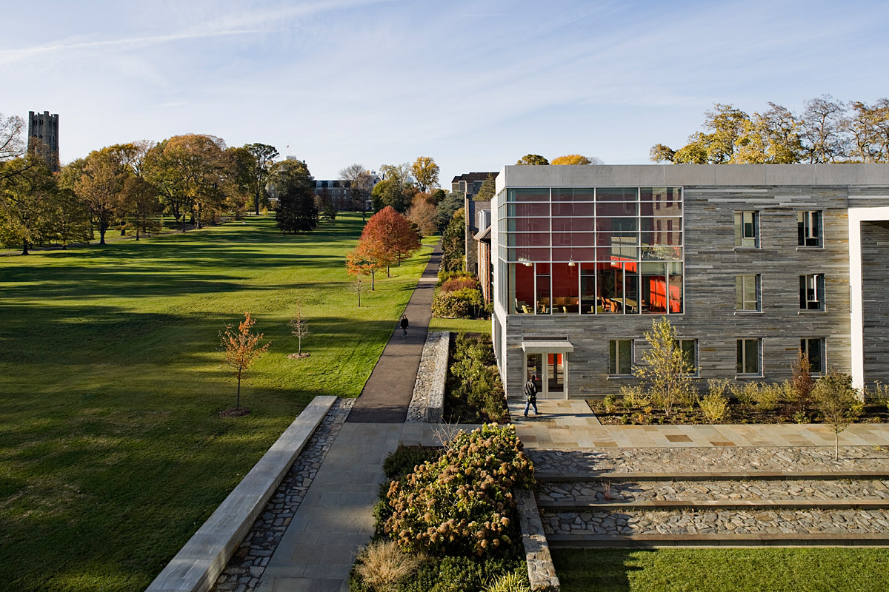

Deep Dreams

Many of the latest advances in image and audio processing (think Facebook's [DeepFace](https://research.facebook.com/publications/480567225376225/deepface-closing-the-gap-to-human-level-performance-in-face-verification/) or Apple's [Siri](http://www.wired.com/2014/06/siri_ai/)) have come from developments in neural networks. Neural networks are inspired by the workings of the human brain, but their implementations have little to do with our biology. 

Neural networks are composed of a series of layers that transform input a certain way – there are lots of different kinds of layers, and computer scientists still aren't quite sure why they work or how best to design a neural network. Google recently released a new design schema they called the [Inception architecture](http://www.cv-foundation.org/openaccess/content_cvpr_2015/papers/Szegedy_Going_Deeper_With_2015_CVPR_paper.pdf) (named after exactly what you think – check out their first footnote), which achieved state-of-the-art performance on a standard image recognition task. This architecture is a bit complicated (see below), so some of Google's engineers started experimenting with how to visualize what the neural network does.

In June, Google published a [blog post](http://googleresearch.blogspot.com/2015/06/inceptionism-going-deeper-into-neural.html) on visualizing the process at each layer in the neural network. We know that lower layers of neural networks pick up simple features, like lines and corners, and successive layers aggregate these features to build up more complex features like shapes and structures. To see which features are being detected by a layer, this visualization approach, now often referred to as Deep Dream, encourages the layers to highlight what they are detecting by passing the output right back through the layer several times. This feedback loop can help us develop an intuition for which features are being detected at which layers.

lower levels
conv2_3x3_reduce.jpg
conv2_norm2.jpg

mid
inception_3b_3x3_reduce.jpg
pool3_3x3_s2.jpg

higher levels
inception_4d_pool_proj.jpg
inception_4d_3x3_reduce.jpg

If you're curious why there are so many dogs in the picture, it's important to remember that the neural network is revealing to us what it has learned: the training model used to generate these pictures, BVLC GoogLeNet, was trained on [ILSVRC2012](http://www.image-net.org/challenges/LSVRC/2014/), which includes many pictures of animals. Deep dream images from models trained on a places dataset, [Places205-GoogLeNet](http://places.csail.mit.edu/downloadCNN.html), highlight different features:

Places

low
conv2_norm2.jpg
inception_3a_pool_proj.jpg

mid
inception_3b_pool.jpg
inception_4a_output.jpg
pool3_3x3_s2.jpg

high
inception_4d_pool.jpg
inception_5b_5x5_reduce.jpg

This serves as a reminder that when it comes to machine learning, the models are important but the data is even more so.

If you're curious to try deep dreaming yourself, K.P. Kaiser put together [a pretty phenomenal walkthrough of that code](http://www.kpkaiser.com/machine-learning/diving-deeper-into-deep-dreams/), which is the basis for [my annotated version](https://github.swarthmore.edu/DeepLearningCS93/pycaffe/blob/master/deepdream.py) of the deep dream code. You'll need to install Caffe, which is a real pain, but fortunately has already been done on the Swarthmore CS lab machines (you're welcome). 

If you want to get a closer look at each of the layers, check out my deep dream output for the [image recognition dataset]() and the [places dataset](http://imgur.com/a/w3xsz), or [make your own](http://deepdreamgenerator.com/).

<!-- 

Documentation for Caffe in Python is [sparse](https://github.com/BVLC/caffe/issues/1774) and a bit of a [work in progress](https://github.com/BVLC/caffe/pull/1703). To try to get a feel for how to use Caffe, I went looking for examples of pyCaffe in the wild and found Google's [Deep Dream](http://googleresearch.blogspot.ch/2015/06/inceptionism-going-deeper-into-neural.html), which they put on [Github](https://github.com/google/deepdream) with some spotty commenting. 

KP Kaiser put together [a pretty phenomenal walkthrough of that code](http://www.kpkaiser.com/machine-learning/diving-deeper-into-deep-dreams/), which is the basis for [my annotated version](https://github.swarthmore.edu/DeepLearningCS93/pycaffe/blob/master/deepdream.py) of the deep dream code.

This led to exploring and trying to understand the Deep Dream code in order to reverse-engineer it. Here's the BVLC GoogleNet Deep Dream @ [2 octaves](http://imgur.com/a/i4CBW) and at [6 octaves](http://imgur.com/a/w3xsz).  -->